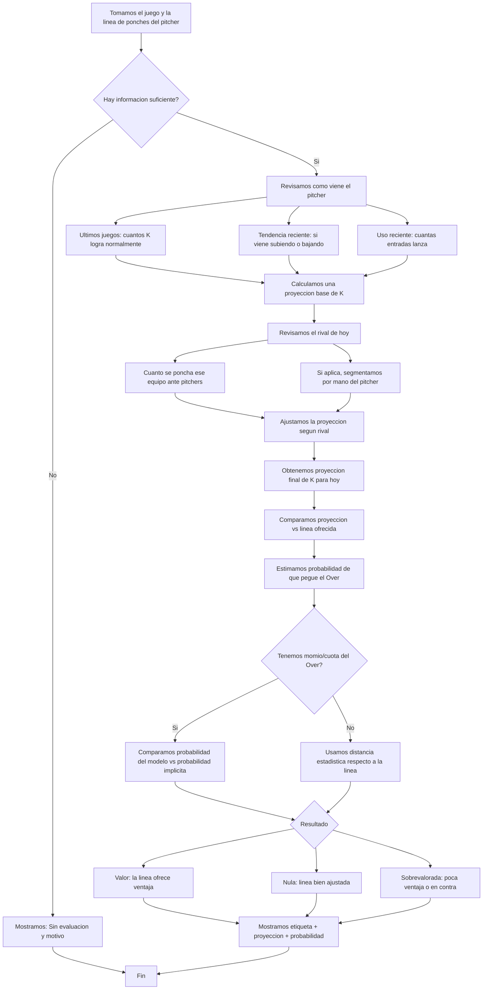

# Gleam Cloud MLB

Aplicacion React para consultar juegos MLB y evaluar si una linea de strikeouts de pitcher tiene valor.

## Modelo de valor para lineas de strikeouts (v1)

El modelo clasifica cada linea en:

- `Valor`
- `Nula`
- `Sobrevalorada`
- `Sin evaluacion` (cuando falta data suficiente)

### Entradas principales

- Linea de strikeouts ofrecida por sportsbook.
- Ultimos juegos finalizados del pitcher (temporada actual).
- Historial del equipo rival sobre strikeouts logrados por starters rivales.
- Mano del pitcher (cuando hay muestra por mano del rival).

### Logica resumida

1. Construye una proyeccion base del pitcher con sus ultimos juegos.
2. Ajusta la proyeccion por contexto del rival actual.
3. Ajusta por carga de trabajo (innings recientes del pitcher).
4. Calcula probabilidad de `Over` sobre la linea.
5. Si hay momio `Over`, calcula edge vs probabilidad implicita.
6. Clasifica la linea en `Valor`, `Nula` o `Sobrevalorada`.
7. Si no hay muestra minima, marca `Sin evaluacion` con motivo.

### Umbrales actuales

- Muestra minima del pitcher: 3 juegos validos.
- Con momio:
  - `Edge >= +4%` => `Valor`
  - `Edge <= -3%` => `Sobrevalorada`
  - En medio => `Nula`
- Sin momio:
  - Se usa Z-score entre proyeccion y linea.

### Diagrama de negocio (Mermaid)

## Notas

- El modelo v1 es explicable y orientado a iterar rapido.
- Se recomienda backtesting para ajustar pesos y umbrales con data historica.

## Backend (Railway + MySQL)

La app puede usar backend para centralizar llamadas a odds y compartir cache entre dispositivos.

- Carpeta backend: `backend/`
- API principal: `POST /odds/lines/by-games`
- Healthcheck: `GET /health`

### Variables backend

- `THE_ODDS_API_KEY`
- `THE_ODDS_API_BASE_URL` (opcional, default The Odds v4)
- `ODDS_CACHE_TTL_MINUTES` (default 10)
- `MYSQLHOST`, `MYSQLPORT`, `MYSQLUSER`, `MYSQLPASSWORD`, `MYSQLDATABASE`

### Desarrollo local

1. Crear entorno virtual Python dentro de `backend`.
2. Instalar dependencias con `pip install -r requirements.txt`.
3. Configurar variables (ver `backend/.env.example`).
4. Ejecutar `uvicorn app.main:app --host 0.0.0.0 --port 8000`.
5. Levantar frontend con Vite; el proxy `/backend-api` apunta a `http://127.0.0.1:8000`.
